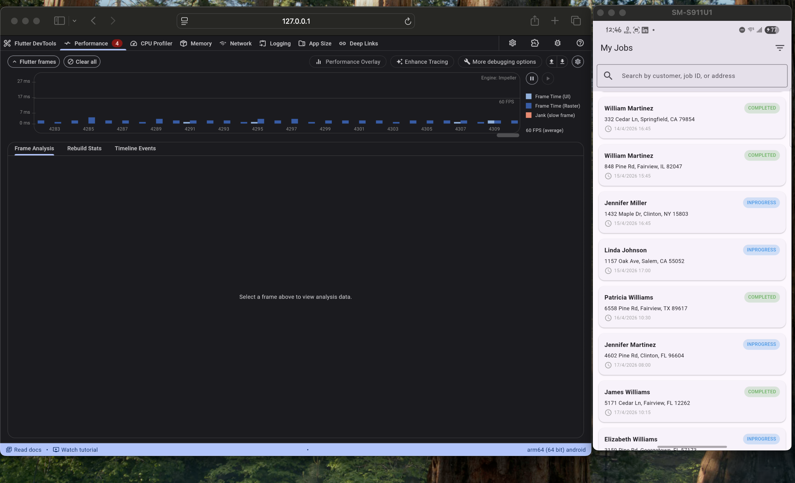

# FieldPulse

FieldPulse is a full-stack field service management application built with Django (Backend) and Flutter (Mobile App).

## Prerequisites

- Docker and docker-compose
- Flutter SDK (for running the mobile app locally)

## How to Run the Project

### Backend

The backend runs using Docker. It includes the Django web application, a PostgreSQL database, and MinIO for S3-compatible file storage.

1. Navigate to the `backend` directory:
   ```bash
   cd backend
   ```
2. Build and start the services using docker-compose:
   ```bash
   docker-compose up --build
   ```
   The API will be available at `http://localhost:8000/`. The admin panel is at `http://localhost:8000/admin/`. MinIO console is available at `http://localhost:9001/` (Credentials: minioadmin / minioadmin).

### Mobile

The Flutter app follows a feature-based MVVM-style architecture using Riverpod for state management and dependency injection.

- Architecture: MVVM-style, where UI screens are the View and `StateNotifier`/`StateNotifierProvider` classes act as ViewModels.
- State management: `flutter_riverpod` with `ProviderScope` at the app root
- Networking: `dio` and `retrofit` for API clients
- Local persistence: `sqflite` for on-device job/queue storage and `flutter_secure_storage` for sensitive data
- Navigation: `go_router`
- App structure: `src/app/providers` for app-level providers, `src/features/*` for feature modules, `src/data/remote` and `src/data/local` for data layers, and `src/services` for sync/notification/background services

1. Navigate to the `mobile/fieldpulse` directory:
   ```bash
   cd mobile/fieldpulse
   ```
2. Get dependencies:
   ```bash
   flutter pub get
   ```
3. Run the app on a connected device or emulator.

   This repo no longer includes shared Firebase keys, so you need to use your own local Firebase configuration.

   - If you have local Firebase platform files, just run:
     ```bash
     flutter run
     ```
   - Otherwise, pass your Firebase values at build time:
     ```bash
     flutter run \
       --dart-define=FIREBASE_ANDROID_API_KEY=your_android_api_key \
       --dart-define=FIREBASE_ANDROID_APP_ID=your_android_app_id \
       --dart-define=FIREBASE_IOS_API_KEY=your_ios_api_key \
       --dart-define=FIREBASE_IOS_APP_ID=your_ios_app_id
     ```
     Add the remaining values as needed for your setup.

   Do not commit your local Firebase config files such as `firebase_options.dart`, `android/app/google-services.json`, or `ios/Runner/GoogleService-Info.plist`.

## How to Run Tests

### Backend Tests

The backend uses Django's built-in testing framework. You can execute them inside the running Docker container.

Using Docker:

```bash
docker-compose exec web python manage.py test tests --verbosity=2
```

### Mobile Tests

The mobile app uses Flutter's test runner for both unit/widget tests and integration tests.

To run unit and widget tests:

```bash
cd mobile/fieldpulse
flutter test
```

To run integration tests (requires a running emulator or connected device):

```bash
flutter test integration_test/app_test.dart
```

## Performance Profiling

The job list maintains 60fps scrolling with 500+ jobs. Below is a profile screenshot from Flutter DevTools showing consistent frame rendering.



## Test Account (seeded automatically)

Email: tech@fieldpulse.com
Password: Tech123!
Role: Technician

## Known Limitations and Incomplete Features

- **Push Notifications:** Fully remote push notifications (e.g., via APNs or FCM) are not fully implemented. Local notifications or basic foreground alerting might be used to simulate this behavior.
- **Advanced Dynamic Checklist Fields:** While the backend supports storing complex JSON schemas for checklists, the mobile UI currently prioritizes the core fields (text, checkbox). More complex interactions like dependent fields or advanced validation rules are simplified.
- **Advanced Conflict UI:** If a job is modified on the server while the technician is offline, the app relies on versioning to prevent data loss, but does not yet feature a detailed side-by-side merge UI for resolving complex text conflicts manually.
- **End-to-End Test Automation:** While an integration test suite is set up to verify the core flows (Login -> Job List -> Detail), it may not cover every single edge case across all offline state transitions.
